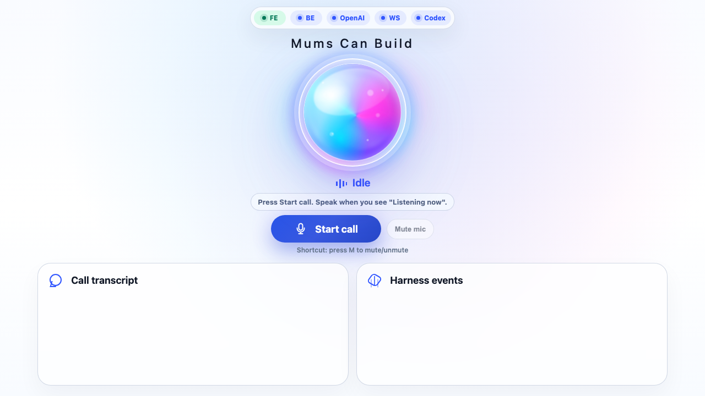
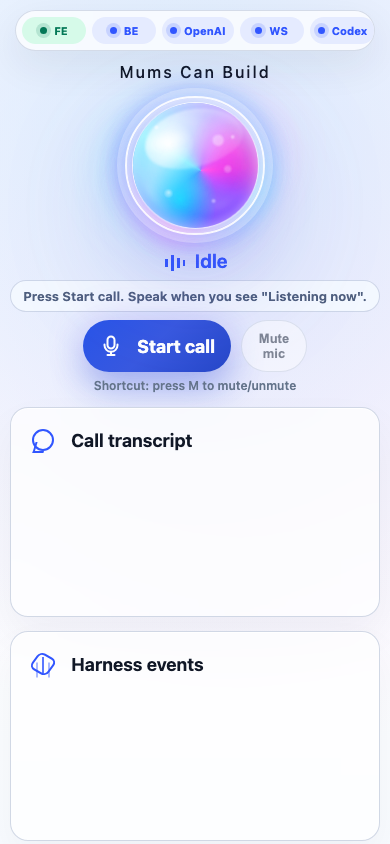

# mums-can-build

Voice-first backend harness that turns spoken software ideas into structured Codex tasks, then coordinates a builder worker and streams progress back to the user.

## Demo video

[](https://youtu.be/ZwM_XMgTcPg)

Direct link: https://youtu.be/ZwM_XMgTcPg

## Product highlights

- Natural voice call UX with real-time turn taking
- Live call transcript (`you` + `assistant`) with streaming updates
- Mic mute/unmute control with keyboard shortcut (`M`)
- Connection health strip for FE/BE/OpenAI/WebSocket/Codex status
- Voice PM that clarifies intent and shapes transcript into a scoped task
- Delegation to mock worker or real Codex CLI worker
- Streaming event log for PM and worker milestones

## UI screenshots

### Desktop voice call view



### Live call in action


### Mobile-sized voice call view



## Current POC

This repo now contains a backend-first transcript-mode POC:

- FastAPI app
- WebSocket session endpoint
- in-memory session state
- voice PM task shaping
- mock Codex worker
- real Codex CLI subprocess bridge
- terminal WebSocket client

The first target loop is:

```text
transcript input
→ voice PM clarifies or creates task JSON
→ mock/real Codex worker starts
→ progress events stream back
→ completion event returns
```

## Run locally

```bash
uv sync
uv run uvicorn app.main:app --reload
```

Open the browser voice call UI:

```text
http://127.0.0.1:8000
```

In another terminal:

```bash
uv run python scripts/ws_client.py "Build a simple booking app with a form and confirmation page"
```

Use the real Codex worker only when you want the harness to edit a workspace:

```bash
uv run python scripts/ws_client.py \
  "Build a simple README improvement" \
  --worker real \
  --workspace /path/to/test/repo
```

## WebSocket message

Connect to:

```text
ws://127.0.0.1:8000/ws/{session_id}
```

Send:

```json
{
  "type": "user.transcript",
  "text": "Build a cake order app with a menu and checkout request form",
  "worker": "mock"
}
```

Key streamed event types:

- `session.started`
- `user.transcript`
- `pm.thinking`
- `pm.question`
- `pm.task_ready`
- `codex.started`
- `codex.log`
- `codex.done`
- `session.error`

## Test

```bash
uv run pytest
```

## Voice call mode

The browser UI uses WebRTC for microphone input and audio output. FastAPI proxies the SDP offer to OpenAI Realtime, so `OPENAI_API_KEY` stays server-side.

Requirements:

- `.env` contains `OPENAI_API_KEY`
- browser microphone permission is allowed
- run the server with `uv run uvicorn app.main:app --reload`

Flow:

```text
browser microphone
→ OpenAI Realtime WebRTC
→ completed transcript event
→ harness WebSocket
→ PM task shaping / Codex worker
→ spoken milestone sent back through Realtime
```

Use `Mock` worker first. Use `Real Codex` only with a safe test workspace path.
